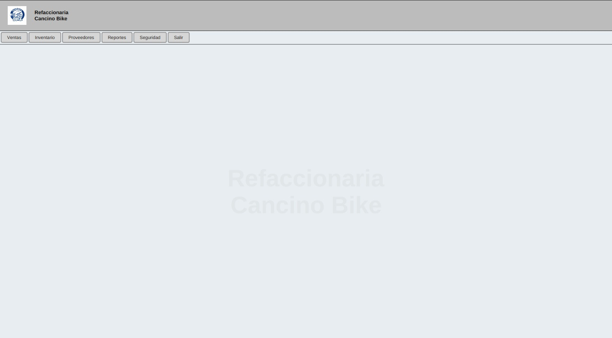

# Modulo Dashboard

### Objetivo

Servir como pantalla principal de navegacion.

### Opciones disponibles

- `Ventas`: abre el modulo de ventas.
- `Inventario`: abre el modulo de productos e inventario.
- `Proveedores`: abre el modulo de proveedores, historial y ordenes de compra.
- `Reportes`: abre reportes y corte de caja.
- `Seguridad`: abre administracion de usuarios, privilegios, accesos y cambio de password.
- `Salir`: cierra la sesion y regresa al Login.

### Practica sugerida

Entrar a cada modulo y regresar al Dashboard para identificar la navegacion principal.

## Captura de pantalla

