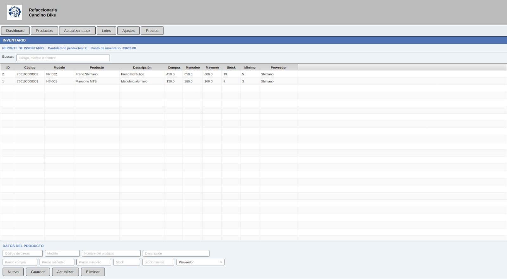

# Modulo Inventario

### Objetivo

Administrar productos, precios, stock y alertas de stock bajo.

### Elementos principales

- Resumen de cantidad de productos.
- Costo total del inventario.
- Buscador por codigo, modelo o nombre.
- Tabla de productos.
- Formulario de datos del producto.
- Botones: `Nuevo`, `Guardar`, `Actualizar`, `Eliminar`.
- Opciones laterales: `Productos`, `Actualizar stock`, `Lotes`, `Ajustes`, `Precios`.

### Consultar productos

1. Entrar a `Inventario`.
2. Revisar la tabla principal.
3. Usar el buscador para filtrar por codigo, modelo o nombre.
4. Observar los productos resaltados: el sistema marca en rojo los productos con stock menor o igual al stock minimo.

### Registrar un producto

1. Presionar `Nuevo`.
2. Capturar:
   - Codigo de barras.
   - Modelo.
   - Nombre del producto.
   - Descripcion.
   - Precio de compra.
   - Precio menudeo.
   - Precio mayoreo.
   - Stock.
   - Stock minimo.
   - Proveedor.
3. Presionar `Guardar`.

### Actualizar datos generales

1. Seleccionar un producto de la tabla.
2. Modificar los campos necesarios.
3. Presionar `Actualizar`.

### Actualizar solo stock

1. Seleccionar un producto.
2. Presionar `Actualizar stock`.
3. Modificar `Stock` o `Stock minimo`.
4. Presionar `Actualizar`.

### Actualizar solo precios

1. Seleccionar un producto.
2. Presionar `Precios`.
3. Modificar precio de compra, menudeo o mayoreo.
4. Presionar `Actualizar`.

### Ajuste de inventario

1. Seleccionar un producto.
2. Presionar `Ajustes`.
3. Escribir el stock real contado fisicamente.
4. Presionar `Actualizar`.

### Eliminar producto

1. Seleccionar un producto.
2. Presionar `Eliminar`.
3. Confirmar la accion.

El sistema realiza una baja logica: cambia el estado del producto a inactivo, no borra fisicamente el registro.

### Validaciones importantes

- El codigo de barras no debe repetirse al registrar un producto nuevo.
- Los precios y stock deben ser numericos.
- Los precios no pueden ser negativos.
- El stock no puede ser negativo.
- Precio menudeo y precio mayoreo no deberian ser menores al precio de compra.
- Debe seleccionarse un proveedor.

### Funcion parcial

La opcion `Lotes` muestra un mensaje indicando que el control de lotes se implementara con la tabla `lotes`. El esquema de base de datos ya contiene la tabla, pero el modulo operativo de lotes aun no esta implementado en el controlador.

### Practica sugerida

- Registrar un producto de prueba.
- Cambiar su stock minimo para provocar alerta de stock bajo.
- Actualizar sus precios.
- Darlo de baja con `Eliminar`.

## Captura de pantalla

