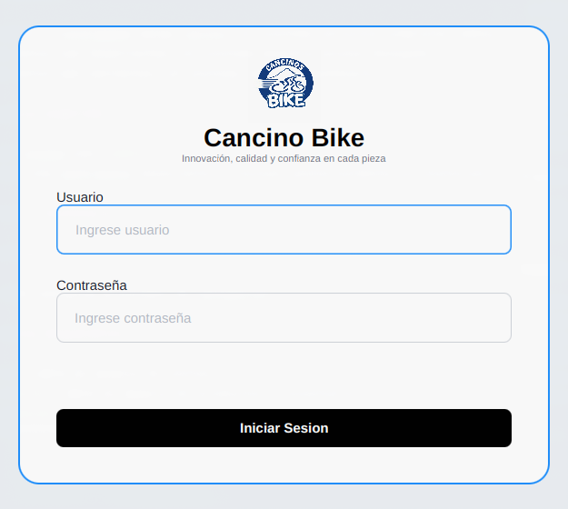

# Modulo Login

### Objetivo

Permitir que solo usuarios registrados y activos entren al sistema.

### Procedimiento

1. Abrir el sistema.
2. Escribir el usuario en el campo `Usuario`.
3. Escribir la contrasena en el campo `Contrasena`.
4. Presionar `Iniciar Sesion`.

### Validaciones

- Si usuario o contrasena estan vacios, el sistema solicita completar ambos campos.
- Si los datos son incorrectos, el sistema muestra acceso denegado.
- Si los datos son correctos, el sistema abre el Dashboard.

### Practica sugerida

- Iniciar sesion con `admin / 12345`.
- Intentar una contrasena incorrecta y revisar posteriormente el historial en Seguridad > Accesos.

## Captura de pantalla

