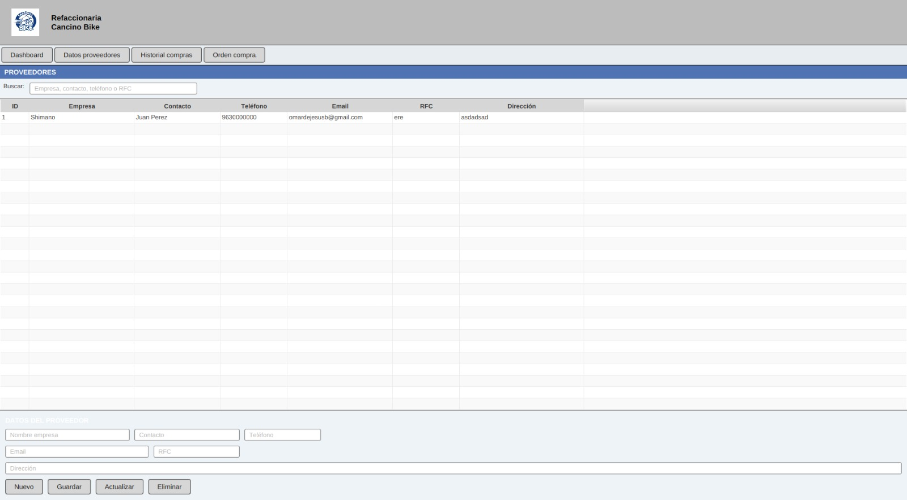

# Modulo Proveedores

### Objetivo

Administrar proveedores, consultar historial de compras y generar ordenes de compra.

### Elementos principales

- Buscador por empresa, contacto, telefono o RFC.
- Tabla de proveedores.
- Formulario de datos del proveedor.
- Historial de compras por proveedor.
- Panel de orden de compra.

### Registrar proveedor

1. Entrar a `Proveedores`.
2. Presionar `Datos proveedores`.
3. Capturar:
   - Nombre empresa.
   - Contacto.
   - Telefono.
   - Email.
   - RFC.
   - Direccion.
4. Presionar `Guardar`.

### Actualizar proveedor

1. Seleccionar un proveedor en la tabla.
2. Modificar los datos.
3. Presionar `Actualizar`.

### Eliminar proveedor

1. Seleccionar un proveedor.
2. Presionar `Eliminar`.
3. Confirmar.

El sistema realiza una baja logica del proveedor: cambia su estado a inactivo.

### Consultar historial de compras

1. Seleccionar un proveedor.
2. Presionar `Historial compras`.
3. Revisar compras, productos, cantidades, precios, subtotales y total de compra.

### Crear orden de compra

1. Seleccionar un proveedor.
2. Presionar `Orden compra`.
3. Seleccionar un producto.
4. Capturar cantidad.
5. Capturar precio estimado.
6. Presionar `Agregar`.
7. Repetir si se agregaran mas productos.
8. Revisar el total estimado.
9. Presionar `Guardar orden`.

Al guardar, el sistema crea registros en:

- `ordenes_compra`.
- `detalle_orden_compra`.

### Validaciones importantes

- El nombre de empresa es obligatorio.
- El telefono debe tener 10 digitos si se captura.
- El email debe tener formato valido si se captura.
- El RFC debe tener 12 o 13 caracteres si se captura.
- No se permite registrar dos proveedores con el mismo nombre de empresa.
- En ordenes de compra, cantidad y precio deben ser numericos y mayores a cero.

### Practica sugerida

- Registrar un proveedor de prueba.
- Actualizar sus datos.
- Crear una orden de compra con dos productos.
- Revisar el historial de compras de un proveedor existente.

## Captura de pantalla

