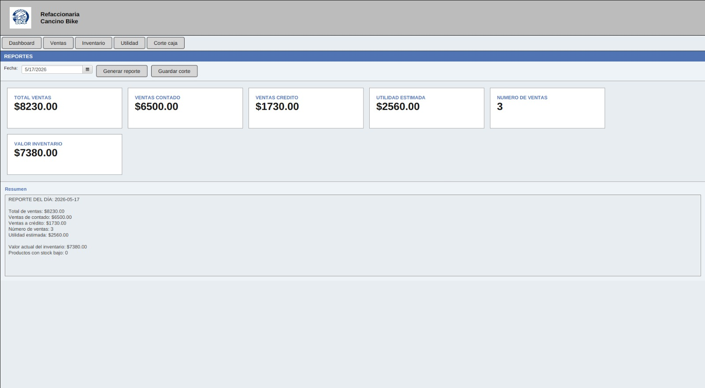

# Modulo Reportes

### Objetivo

Consultar informacion resumida de ventas, inventario, utilidad y corte de caja.

### Elementos principales

- Selector de fecha.
- Tarjetas de resumen:
  - Total ventas.
  - Ventas contado.
  - Ventas credito.
  - Utilidad estimada.
  - Numero de ventas.
  - Valor inventario.
- Area de resumen.
- Botones: `Ventas`, `Inventario`, `Utilidad`, `Corte caja`, `Generar reporte`, `Guardar corte`.

### Generar reporte diario

1. Entrar a `Reportes`.
2. Seleccionar una fecha.
3. Presionar `Generar reporte`.
4. Revisar las tarjetas y el resumen.

El sistema calcula:

- Total de ventas no canceladas.
- Total de ventas de contado.
- Total de ventas a credito.
- Numero de ventas.
- Utilidad estimada.
- Valor actual del inventario.
- Productos con stock bajo.

### Reporte de ventas

1. Seleccionar fecha.
2. Presionar `Ventas`.
3. Revisar el resumen del dia.

### Reporte de inventario

1. Presionar `Inventario`.
2. Revisar valor del inventario y productos con stock bajo.

### Reporte de utilidad

1. Seleccionar fecha.
2. Presionar `Utilidad`.
3. Revisar la utilidad estimada.

La utilidad se calcula con la formula:

```text
(precio_unitario - precio_compra) * cantidad vendida
```

### Guardar corte de caja

1. Seleccionar fecha.
2. Presionar `Generar reporte`.
3. Presionar `Guardar corte`.
4. Confirmar la accion.

El sistema guarda el corte en la tabla `cortes_caja`.

### Practica sugerida

- Registrar una venta.
- Entrar a Reportes y generar el reporte de la fecha actual.
- Guardar el corte de caja.

## Captura de pantalla


