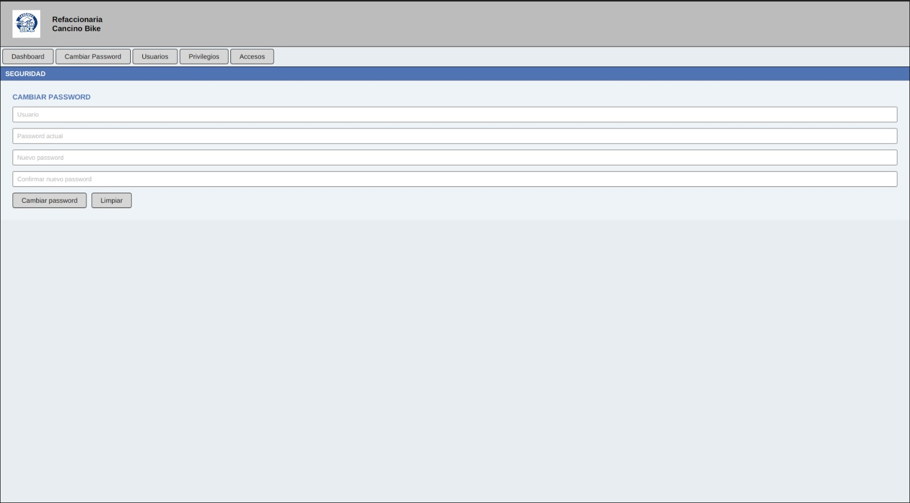
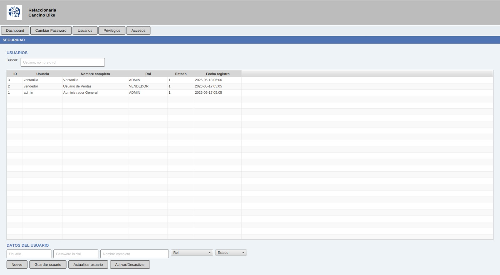
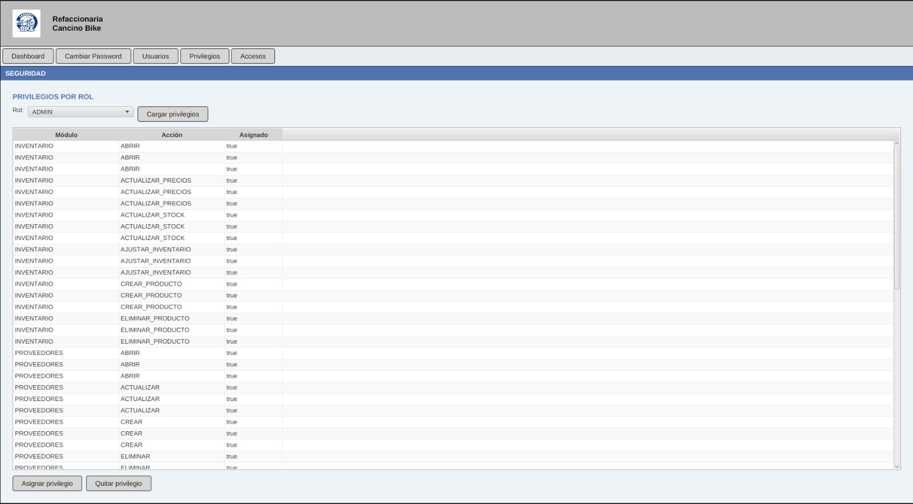
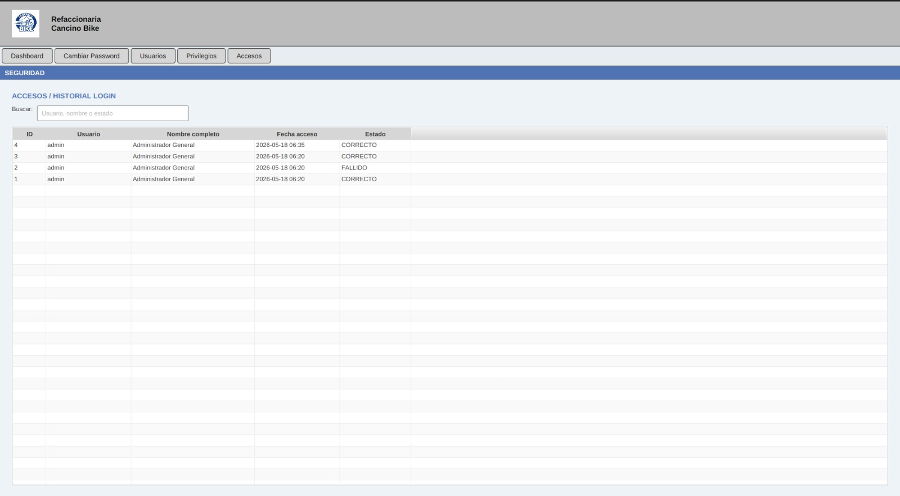

# Modulo Seguridad

### Objetivo

Administrar usuarios, contrasenas, privilegios y registro de accesos.

### Cambiar password

1. Entrar a `Seguridad`.
2. Presionar `Cambiar Password`.
3. Capturar:
   - Usuario.
   - Password actual.
   - Nuevo password.
   - Confirmacion del nuevo password.
4. Presionar `Cambiar password`.

Validaciones:

- Todos los campos son obligatorios.
- El nuevo password debe tener al menos 4 caracteres.
- El nuevo password y la confirmacion deben coincidir.
- El nuevo password no puede ser igual al actual.
- El usuario y password actual deben ser correctos.

### Administrar usuarios

1. Presionar `Usuarios`.
2. Usar el buscador para localizar por usuario, nombre o rol.
3. Para crear usuario:
   - Presionar `Nuevo`.
   - Capturar usuario, password inicial, nombre completo y rol.
   - Presionar `Guardar usuario`.
4. Para actualizar:
   - Seleccionar usuario.
   - Modificar usuario, nombre, rol o estado.
   - Presionar `Actualizar usuario`.
5. Para activar o desactivar:
   - Seleccionar usuario.
   - Presionar `Activar/Desactivar`.

### Administrar privilegios

1. Presionar `Privilegios`.
2. Seleccionar un rol.
3. Presionar `Cargar privilegios`.
4. Seleccionar un privilegio.
5. Presionar `Asignar privilegio` o `Quitar privilegio`.

Los privilegios disponibles en base de datos incluyen acciones de:

- Ventas.
- Inventario.
- Proveedores.
- Reportes.
- Seguridad.

Nota operativa: el sistema registra y administra privilegios por rol, pero la navegacion visible actual no bloquea botones por privilegio desde el controlador de Dashboard. Para capacitacion, explicar los privilegios como administracion registrada en base de datos y considerar validacion adicional si el sistema pasara a produccion.

### Revisar accesos

1. Presionar `Accesos`.
2. Revisar usuario, nombre completo, fecha y estado.
3. Usar el buscador por usuario, nombre o estado.

### Practica sugerida

- Crear un usuario de prueba.
- Cambiarlo de rol.
- Desactivarlo y volverlo a activar.
- Revisar accesos correctos y fallidos.

## Capturas de pantalla

