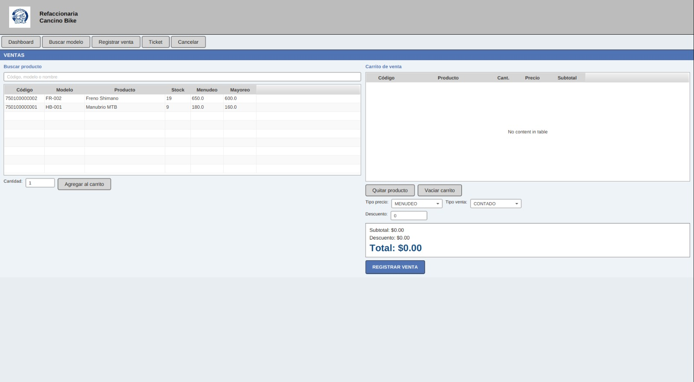

# Modulo Ventas

### Objetivo

Registrar ventas de productos disponibles en inventario, descontar stock automaticamente, generar un ticket digital y, si aplica, crear un credito.

### Elementos principales

- Buscador de producto por codigo, modelo o nombre.
- Tabla de productos disponibles.
- Campo `Cantidad`.
- Boton `Agregar al carrito`.
- Carrito de venta.
- Tipo de precio: `MENUDEO` o `MAYOREO`.
- Tipo de venta: `CONTADO` o `CREDITO`.
- Cliente y fecha limite, visibles solo cuando la venta es a credito.
- Campo de descuento.
- Totales: subtotal, descuento y total.
- Boton `REGISTRAR VENTA`.

### Registrar una venta de contado

1. Entrar al modulo `Ventas`.
2. Buscar el producto por codigo, modelo o nombre.
3. Seleccionar el producto en la tabla.
4. Escribir la cantidad.
5. Elegir tipo de precio: `MENUDEO` o `MAYOREO`.
6. Presionar `Agregar al carrito`.
7. Repetir el proceso si se agregaran mas productos.
8. Verificar subtotal, descuento y total.
9. Seleccionar tipo de venta `CONTADO`.
10. Presionar `REGISTRAR VENTA`.
11. Confirmar la venta.

Al guardar, el sistema:

- Registra la venta en la tabla `ventas`.
- Registra cada producto en `detalle_ventas`.
- Descuenta el stock en `productos`.
- Genera un ticket en la tabla `tickets`.
- Marca la venta como `PAGADA`.

### Registrar una venta a credito

1. Agregar productos al carrito.
2. Seleccionar tipo de venta `CREDITO`.
3. Seleccionar el cliente.
4. Seleccionar la fecha limite de pago.
5. Verificar el total.
6. Presionar `REGISTRAR VENTA`.
7. Confirmar la venta.

Al guardar, el sistema:

- Registra la venta como `PENDIENTE`.
- Descuenta el stock.
- Genera ticket digital.
- Crea un registro en la tabla `creditos` con saldo pendiente igual al total.

### Quitar o modificar productos del carrito

- Para quitar un producto, seleccionarlo en el carrito y presionar `Quitar producto`.
- Tambien se puede quitar con doble clic sobre el producto del carrito.
- Para cambiar cantidad, editar la cantidad directamente en la columna `Cant.` del carrito.
- Para limpiar toda la venta, presionar `Vaciar carrito` o `Cancelar`.

### Validaciones importantes

- La cantidad debe ser numerica y mayor a cero.
- No se permite vender mas unidades que el stock disponible.
- El descuento no puede ser negativo ni mayor al subtotal.
- En venta a credito se requiere cliente y fecha limite.

### Practica sugerida

- Registrar una venta de contado con un producto.
- Registrar una venta a credito con cliente y fecha limite.
- Intentar agregar una cantidad mayor al stock para observar la validacion.

## Captura de pantalla

